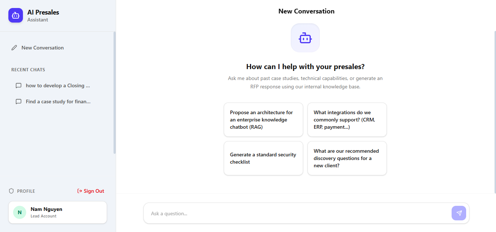

# Enterprise RAG Agent

A robust, production-ready Retrieval-Augmented Generation (RAG) system built to handle complex enterprise documents and provide highly accurate, context-aware answers. Powered by **React**, **FastAPI**, **LangGraph**, and **Google Gemini 3.1 Flash Lite**.



## 🌟 Key Features

### 🧠 Advanced RAG Capabilities

- **Contextual Chunking:** Instead of splitting text blindly, the system uses LLMs to generate a document-level summary and prepends this global context to every chunk. This ensures chunks retain their meaning even when isolated.
- **Vision-based Multimodal Extraction:** Processes complex PDFs containing diagrams, tables, and mixed content using Gemini Vision OCR, preserving the structural layout and extracting deep visual insights.
- **Multi-Vector Retrieval:** Separates search indexing (summaries stored in ChromaDB) from generation context (full text stored in LocalFileStore) for maximum retrieval accuracy.
- **Multi-Stage Agentic Workflow:** Utilizes **LangGraph** to build a robust state machine for query processing (Init → Retrieve → Synthesis → Finalize) with automatic fallback and relaxation strategies.
- **Smart Caching:** Employs both semantic (Cosine) and lexical (Jaccard) similarity caching to instantly return previously verified answers, saving LLM tokens and reducing latency.

### 🏢 Enterprise-Grade Data Ingestion

- **Queue-based Background Processing:** Safely handles multiple large document uploads concurrently using an asynchronous background worker queue.
- **Automated Rate Limiting & Retry:** Built-in Exponential Backoff using `tenacity` ensures stable API calls without hitting provider limits.
- **Garbage Collection:** Automatically cleans up physical files from the server after successful ingestion or manual rollback to prevent storage bloat.

### 🛡️ Admin & Analytics Dashboard

- **Role-based Access Control (RBAC):** Distinct permission levels (Guest, Employee, Lead, Manager, SuperManager) to control who can view or upload documents.
- **Knowledge Gap Analysis:** AI-powered analytics that automatically scans user queries to identify missing topics in the knowledge base and suggests new documents to upload.
- **Feedback Loop:** Tracks Thumbs Up/Down and user notes to continuously evaluate response quality.

---

## 🛠️ Tech Stack

- **Frontend:** React 18, TypeScript, Tailwind CSS, Vite, Lucide Icons.
- **Backend:** FastAPI, Python 3.10+, SQLAlchemy, Pydantic.
- **AI & RAG:** LangChain, LangGraph, Google Gemini API (`gemini-3.1-flash-lite-preview`).
- **Database:** PostgreSQL 16 (Relational data), ChromaDB (Vector store).
- **Deployment:** Docker, Docker Compose, Nginx.

---

## 🚀 Getting Started

### Prerequisites

- [Docker](https://docs.docker.com/get-docker/) and [Docker Compose](https://docs.docker.com/compose/install/)
- A Google Gemini API Key (Get one from [Google AI Studio](https://aistudio.google.com/))

### 1. Clone the Repository

```bash
git clone https://github.com/yourusername/Enterprise-RAG-Agent.git
cd Enterprise-RAG-Agent
```

### 2. Environment Configuration

Copy the example environment file and add your API key:

```bash
cp .env.example .env
```

Edit `.env` and set your credentials:

```env
GEMINI_API_KEY=your_actual_api_key_here

# Optional: Adjust ingestion workers
INGEST_NUM_WORKERS=4
MAX_FILE_SIZE_MB=50
```

### 3. Run with Docker (Recommended)

Launch the entire stack (Postgres, FastAPI Backend, React Frontend) with a single command:

```bash
docker-compose up --build -d
```

- **Frontend Application:** `http://localhost:3000`
- **Backend API Docs:** `http://localhost:3005/docs`

### Default Admin Account

On the first run, the system automatically creates a SuperManager account:

- **Username:** `admin`
- **Password:** `admin123`

---

## 💻 Manual Development Setup

If you prefer to run the services locally without Docker:

**1. Start the PostgreSQL Database**
Ensure you have a Postgres instance running with the credentials specified in your `.env` file (`DATABASE_URL`).

**2. Setup Backend**

```bash
cd backend
python -m venv venv
source venv/bin/activate  # On Windows: venv\Scripts\activate
pip install -r requirements.txt
python -m uvicorn main:app --port 3005 --reload
```

**3. Setup Frontend**
Open a new terminal:

```bash
npm install
npm run dev:frontend
```

---

## 📂 Project Structure

```text
├── backend/
│   ├── agents/          # LangGraph state machine and memory management
│   ├── ingestion.py     # PDF parsing, Vision OCR, and Contextual Chunking
│   ├── main.py          # FastAPI endpoints, DB routing, and Queue workers
│   └── models.py        # SQLAlchemy database schemas
├── src/                 # React Frontend
│   ├── components/      # UI Components (Chat, Admin Dashboard, Knowledge Base)
│   ├── hooks/           # Custom React hooks (useApi, useChat)
│   └── App.tsx          # Main application routing and state
├── docker-compose.yml   # Multi-container orchestration
└── .env.example         # Environment variables template
```

---

## 🤝 Contributing

Contributions, issues, and feature requests are welcome! Feel free to check the [issues page](https://github.com/yourusername/Enterprise-RAG-Agent/issues).

## 📄 License

This project is licensed under the MIT License - see the [LICENSE](LICENSE) file for details.
